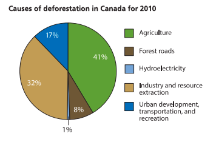
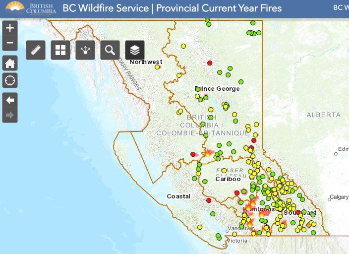
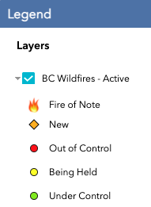
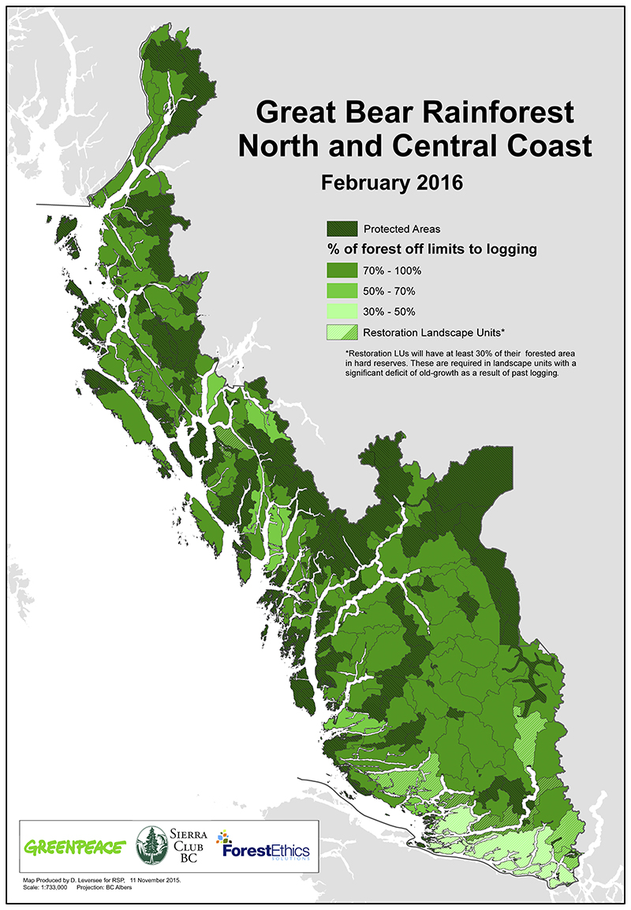

# Deforestation of Pacific Temperate Rainforests
<i>most recently updated on February 7, 2022</i>

## Introduction
This project serves as my Capstone project in my [General Assembly - Data Science Immersive program](https://generalassemb.ly/education/data-science-immersive-remote) that I was enrolled in from **June 14, 2021 to September 8, 2021,** and showcases my Python skills and techniques I've acquired in Data Collection, Data Cleaning, Exploratory Data Analysis, Machine Learning and Deep Learning over the past 13 weeks.

<b><i>This project is designed to be a comprehensive assessment of the deforestation of the Pacific Temperate Rainforests in the west coast of North America, spanning The United States and Canada, and is fully intended to be a presentable project repository.</i></b> However, this is by no means a completed project. Because climate is constantly changing, any data science project dealing with climate issues can be updated to account for current, real-time data. I plan to supplement and enhance the contents of this project with new data as it becomes available, as well as new skills and techniques that I learn going forward in my career as a data scientist.)

## Background

<b><u>What is a temperate rainforest?</u></b>

According to [Professor Paul Alaback](https://www.cfc.umt.edu/personnel/details.php?ID=1106) (current Professor Emeritus of Forest Ecology at the University of Montana), as referenced in his paper entitled ['Comparative ecology of temperate rainforests of the Americas along analogous climatic gradients,'](http://rchn.biologiachile.cl/pdfs/1991/3/Alaback_1991.pdf) a temperate rainforest has the below 4 characteristics:
1. Over 1,400 millimeters of precipitation annually, with 10% or more occurring during the summer months,
2. Cool frequently overcast summers under 16 degrees Celsius,
3. Fire is infrequent and not an important evolutionary factor, and
4. Dormant season caused by low temperatures may be accompanied by transient snow.

[Wikipedia](https://en.wikipedia.org/wiki/Temperate_rainforest) summarizes this well in layman's terms: "Temperate rainforests are coniferous or broadleaf forests that occur in the temperate zone and receive heavy rain."

Various websites encountered through google searches provide information on temperate rainforests, but many seem to shy away from providing a clear definition of this ecosystem. However, through browsing the contents of these pages, it is apparent that they are referring to the abovementioned characteristics of the temperate rainforests outlined by Professor Alaback.

<b><u>Where are the temperate rainforests located?</u></b>

Despite the lack of clarity in defining the term <i>'temperate rainforest,'</i> most sources, including [Professor Alaback](http://rchn.biologiachile.cl/pdfs/1991/3/Alaback_1991.pdf) and the [World Wildlife Federation](https://www.worldwildlife.org/biomes/temperate-coniferous-forest) appear to be agreement in referring to the following areas as <i>'temperate rainforests,' with the below two rainforests being the largest in size</i> :
1. **The northern Pacific coast of North America,** ranging from a narrow band along the Olympic Peninsula in Washington State, extending through British Columbia into southeastern Alaska, (some sources will argue that this region will extend to California)
2. **southern Chile** from Valdivia in the coast and Conguillio in the Andes south to western Tierra del Fuego,  

Isolated patches of rainforest in the below regions:

3. <b>The Northeastern Atlantic (including portions of Ireland, Scotland and Iceland),</b>
4. <b>Southwestern Japan,</b>
5. <b>Regions of New Zealand, </b>
6. <b>Regions of Tasmania,</b> and
7. <b>Regions of the eastern Black Sea</b>

In this project, I'd like to focus on the <b>Pacific temperate rainforests (the region of rainforests in the Pacific Northwest region of the United States),</b> the largest temperate rainforest region in the world.

<b><u>How does deforestation come into play for the Pacific temperate rainforests?</u></b>

Let us consider our neighbors to the north, Canada. Close to 25% of the world's temperate rainforests are located in British Columbia, Canada [(Source)](https://www.hellobc.com/stories/bcs-unique-temperate-rainforest/). 

Environmentalists, such as the author of this [article](https://thenarwhal.ca/canadas-forgotten-rainforest/) and the Canadian government, seem to disagree on the extent of deforestation in Canada, as evidenced by Natural Resources Canada's [publication on deforestation](https://d1ied5g1xfgpx8.cloudfront.net/pdfs/36710.pdf).

Natural Resources Canada insists that deforestation affects less than 0.2% of Canada's forests per year. 

They also claim that Canada's deforestation rate accounts for approximately 0.3% of global deforestation, which is much less than Canada's 9% share of the world's forests.

<i>Fig 1: A pie chart showing causes of deforestation in Canada for 2010 (credit to Natural Resources Canada)</i>
 
 

It is interesting to note that many sources, including Natural Resources Canada's publication referenced above and an article from Sciencing [(Source)](https://sciencing.com/limiting-factors-of-temperate-forests-13406003.html) mention human factors as a primary reason for deforestation, but do not reference forest fires.

<b><i>This fact confused me, as the very reason why I chose to explore this topic was because of various forest fires due to the warmer weather in British Columbia this summer.</i></b>

The BC Wildfire Service (under the government of British Columbia) has a [real-time tracker of forest fires](https://arcg.is/1yW5ii) in the province.

It shows that as of this summer, only two uncontrollable forestfires as of today, September 8, 2021 are situated near the coast.

<i>Fig 2: Forest Fires in British Columbia as of today (credit to BC Wildfire Services)</i>
 
 

<i>Fig 3: Map of the Great Bear Rainforest [(Canopy Planet)](https://canopyplanet.org/campaigns/protecting-forests/the-coastal-temperate-rainforest/protecting-the-great-bear-rainforest/) </i>
 
 
This seems to be consistent with Professor Alaback's definition of a temperate rainforest, with one condition where <i>"Fire is infrequent and not an important evolutionary factor".</i>

## Problem Statement

Given the magnitude of area classified as part of the Pacific temperate rainforests ecosystem, I would like to break this project down into smaller pieces and take the following steps to tackle this problem:

I seek to create an optimal model to predict the trend of deforestation in the Central Coast region of British Columbia, where a large portion of the Great Bear Rainforest is situated.

[Global Forest Watch](https://www.globalforestwatch.org/dashboards/country/CAN/?category=summary&dashboardPrompts=eyJzaG93UHJvbXB0cyI6dHJ1ZSwicHJvbXB0c1ZpZXdlZCI6WyJkb3dubG9hZERhc2hib2FyZFN0YXRzIiwid2lkZ2V0U2V0dGluZ3MiXSwic2V0dGluZ3MiOnsic2hvd1Byb21wdHMiOnRydWUsInByb21wdHNWaWV3ZWQiOlsiZG93bmxvYWREYXNoYm9hcmRTdGF0cyJdLCJzZXR0aW5ncyI6eyJzaG93UHJvbXB0cyI6dHJ1ZSwicHJvbXB0c1ZpZXdlZCI6W10sInNldHRpbmdzIjp7Im9wZW4iOmZhbHNlLCJzdGVwSW5kZXgiOjAsInN0ZXBzS2V5IjoiIn0sIm9wZW4iOnRydWUsInN0ZXBzS2V5IjoiZG93bmxvYWREYXNoYm9hcmRTdGF0cyJ9LCJvcGVuIjp0cnVlLCJzdGVwSW5kZXgiOjAsInN0ZXBzS2V5Ijoid2lkZ2V0U2V0dGluZ3MifSwic3RlcHNLZXkiOiJ3aWRnZXRTZXR0aW5ncyIsInN0ZXBJbmRleCI6LTEsImZvcmNlIjp0cnVlfQ%3D%3D&location=WyJjb3VudHJ5IiwiQ0FOIiwiMiIsIjUiXQ%3D%3D&map=eyJjZW50ZXIiOnsibGF0Ijo1Mi4yNDY3MzUyNjYyNTQxLCJsbmciOi0xMjYuOTQyNDM2MjE0OTk1OTZ9LCJ6b29tIjo3LjEyNzM1MzYxNzM5MTE0MSwiY2FuQm91bmQiOmZhbHNlLCJkYXRhc2V0cyI6W3siZGF0YXNldCI6InBvbGl0aWNhbC1ib3VuZGFyaWVzIiwibGF5ZXJzIjpbImRpc3B1dGVkLXBvbGl0aWNhbC1ib3VuZGFyaWVzIiwicG9saXRpY2FsLWJvdW5kYXJpZXMiXSwiYm91bmRhcnkiOnRydWUsIm9wYWNpdHkiOjEsInZpc2liaWxpdHkiOnRydWV9LHsiZGF0YXNldCI6InRyZWUtY292ZXItbG9zcyIsImxheWVycyI6WyJ0cmVlLWNvdmVyLWxvc3MiXSwib3BhY2l0eSI6MSwidmlzaWJpbGl0eSI6dHJ1ZSwidGltZWxpbmVQYXJhbXMiOnsic3RhcnREYXRlIjoiMjAwMS0wMS0wMSIsImVuZERhdGUiOiIyMDIwLTEyLTMxIiwidHJpbUVuZERhdGUiOiIyMDIwLTEyLTMxIn0sInBhcmFtcyI6eyJ0aHJlc2hvbGQiOjMwLCJ2aXNpYmlsaXR5Ijp0cnVlfX1dfQ%3D%3D&showMap=true) states the following: "Note that “tree cover loss” is not the same as “deforestation” – tree cover loss includes change in both natural and planted forest, and does not need to be human caused. The data from 2011 onward were produced with an updated methodology that may capture additional loss. Comparisons between the original 2001-2010 data and future years should be performed with caution."

For the purposes of this project, I am considering all loss of forest area to be 'deforestation,' regardless of what the cause/reason is.

## Summary of Current Project Repository
1. Data Cleaning
2. Exploratory Data Analysis
3. Time Series Analysis (in progress)
4. Modelling

## Repository Directory

- data
    - cleaned_data
        - **central_coast_clean_daily_summary_noaa.csv**
        - **central_coast_clean_summary.csv**
        - **central_coast_model_df.csv**
    - gfw
        - cumulative_burned_area
            - **adm1_metadata.csv**
            - **adm2_metadata.csv**
            - **metadata.csv**
            - **modis_burned_area__ha.csv**
        - tree_cover_gain
            - **adm1_metadata.csv**
            - **adm2_metadata.csv**
            - **metadata.csv**
            - **treecover_gain_2000-2012_by_region__ha.csv**
        - tree_cover_loss
            - **adm1_metadata.csv**
            - **adm2_metadata.csv**
            - **metadata.csv**
            - **treecover_extent_2000__ha.csv**
            - **treecover_loss__ha.csv**
    - noaa
        - **2705672.csv**
- notebooks
    - **01_data_cleaning.ipynb**
    - **02_eda_data_visualizations.ipynb**
    - **03_time_series_analysis.ipynb**
    - **04_modelling.ipynb**
- **Presentation Slides.pdf**
- **README.md**

## Data Sources

|File Name|Organization|Dataset Location|FUNCTION (as outlined by Organization)|Description|
|---|---|---|---|---|
|treecover_extent_2000__ha.csv|Global Forest Watch|[TREE COVER LOSS IN CENTRAL COAST, BRITISH COLUMBIA, CANADA](https://gfw.global/2YqqSkz)|Shows year-by-year tree cover loss, defined as stand level replacement of vegetation greater than 5 meters, within the selected area.   The tree cover loss data set is a collaboration of the University of Maryland, Google, USGS, and NASA, and uses Landsat satellite images to map annual tree cover loss at a 30 × 30 meter resolution.   <i>Note that “tree cover loss” is not the same as “deforestation” – tree cover loss includes change in both natural and planted forest, and does not need to be human caused. The data from 2011 onward were produced with an updated methodology that may capture additional loss. Comparisons between the original 2001-2010 data and future years should be performed with caution.</i>|Shows forest area and total area of region in 2020|
|treecover_loss__ha.csv|Global Forest Watch|[TREE COVER LOSS IN CENTRAL COAST, BRITISH COLUMBIA, CANADA](https://gfw.global/2YqqSkz)|Shows year-by-year tree cover loss, defined as stand level replacement of vegetation greater than 5 meters, within the selected area.   The tree cover loss data set is a collaboration of the University of Maryland, Google, USGS, and NASA, and uses Landsat satellite images to map annual tree cover loss at a 30 × 30 meter resolution.   <i>Note that “tree cover loss” is not the same as “deforestation” – tree cover loss includes change in both natural and planted forest, and does not need to be human caused. The data from 2011 onward were produced with an updated methodology that may capture additional loss. Comparisons between the original 2001-2010 data and future years should be performed with caution.</i>|Shows annual tree loss|
|modis_burned_area__ha.csv|Global Forest Watch|[CUMULATIVE BURNED AREA IN CENTRAL COAST, BRITISH COLUMBIA, CANADA](https://gfw.global/3BQJOYm)|Displays monthly burned area extent and date of burn based on differences in a burn-sensitive Vegetation Index derived from MODIS shortwave infrared surface reflectance bands|Shows annual burned area|
|2705672.csv|National Centers for Environmental Information (NCEI)|[Daily Summaries](https://www.ncdc.noaa.gov/cdo-web/orders?email=akira.j.takahashi@gmail.com&id=2705672)|Daily climate normals are computed for the 30 year period from 1981 to 2010 for U.S. stations. Values include temperature, degree days, precipitation, snowfall, frost/freeze dates, climate probabilities and statistics.|Contains information on Temperatures and Precipitation for two weather stations - Bella Bella, BC, Canada and Bella Coola, BC, Canada from 2001 - 2020|

## Data Dictionary for final dataframe

|Feature|Type|Dataset|Description|
|---|---|---|---|
|**YEAR**|*int*|generated|Aggregate of daily summary information - used to consolidate precipitation and temperature observations; converted from datetime type to treat as a categorical variable| 
|**PRCP estimate**|*float*|NCEI|Annual estimate of precipitation (mm)|
|**TMAX**|*float*|NCEI|Annual maximum temperature (Celsius)|
|**TMIN**|*float*|NCEI|Annual minimum temperature (Celsius)|
|**TAVG**|*float*|NCEI|Annual average temperature (Celsius)|
|**area_tree_cover_jan1**|*float*|GFW / generated|Forest area in Central Coast as of January 1 of given year (Hectaire) - 2000 forest area given, and subsequent years calculated|
|**area_tree_cover_loss_Ha**|*float*|GFW|area of tree cover loss (Ha) |
|**area_burn_Ha**|*float*|GFW|area of fire loss (Ha) |
|**area_tree_cover_dec31**|*float*|generated|Forest area in Central Coast as of December 31 of given year, calculated by given data|
|**percentage_tree_cover_loss**|*float*|generated|Tree cover loss divided by Forest area as of January 1 (Ha)|
|**percentage_tree_cover_loss_over_logging_land**|*float*|generated|Tree cover loss divided by Forest area as of January 1 (Ha), given that on February 2016, Great Bear Mountain's logging area limited to 15% of forest|
|**co2_emission_Mg**|*float*|GFW|Carbon Dioxide emission in given year|
|**cumulative_loss_area**|*float*|generated|Cumulative area loss of tree cover and fire (Ha)|
|**true_area_tree_cover_jan1**|*float*|generated|True area of tree cover incorporating fire loss on Jan 1 (Ha)|
|**true_area_tree_cover_dec31**|*float*|generated|True area of tree cover incorporating fire loss on Dec 31(Ha) |
|**true_percentage_tree_cover_loss**|*float*|generated|Percentage of deforestation given true area cover and loss of forest area (Ha) - **This will be estimated using regression models|

## Data Cleaning
- Removing duplicate date summaries through assuming uniform weather between Bella Coola and Bella Bella
- Taking NCEI daily summaries and aggregating for year
- Extrapolating for estimates of Precipitation for years with daily summaries less than 365
- Merging NCEI data with GFW data

## Exploratory Data Analysis

- Plotting daily summaries' precipitation vs date
- Plotting daily summaries' temperature vs date

- Plotting annual precipitation vs year
- Plotting annual temperature vs year
    - Using definition of temperate rainforest, added in horizontal line to indicate threshold of temperature (16 C) and precipitation (1400 mm per year)
    
- Plotting percentage of area loss vs year

## Modeling

Best model for this problem given the data is Extra Trees.

## Conclusion/Recommendations

Consider Central Coast’s forest area of 1.57MHa. If we take 2019 for example, with 2% of deforestation, 320,000 Ha of the Great Bear Rainforest suffered from deforestation.
Since total Canadian forest area was 420 MHa with a deforestation of 2.18 MHa, We can see that the Great Bear Rainforest is clearly showing signs of rapid deforestation.
(1/420 of the forests in Canada accounted for 1/7 of the deforestation…)

Collect more data!!!!
- I only worked with the Central Coast’s forest area, which is 1/420 of Canada’s total forest area
- Extremely difficult to find data on deforestation.
- More predictors - do the botanical species play a role in the preservation of the forest?

Domain Knowledge:
- Alaska’s Tongass Rainforest rivals the Great Bear Rainforest in size and fame. However, I found no information on preservation and restrictions on logging. To the contrary, “On August 2, 2018 the U.S. Forest Service announced that it signed an agreement with the State of Alaska to roll back the Roadless Rule, opening the Tongass National Forest to new road construction that would allow for increased resource extraction in the form of old-growth timber logging.” Effects of regulations by country on rainforest preservation (of course!)

## Future Study possibilities

- The relationship between PM2.5 (fire) and COVID-19 cases

## References:

As this is an ongoing project, I am currently in the process of organizing the references and resources used in both my datasets and README writeup. Therefore, the citations are not organized in traditional citation style techniques.

As of this current version of the README, every attempt has been made to reference sources directly when mentioned within this README document. I would also like to provide quick links of all websites referenced in this README document. If you have any questions regarding the content of this project, please feel free to reach out to me via [email](mailto:akira.j.takahashi@gmail.com). I would be more than happy to address any questions you may have.

- https://www.cbc.ca/news/canada/british-columbia/bc-wildfire-update-sept3-1.6163734
- https://www.nytimes.com/2021/08/12/world/canada/british-columbia-wildfires.html
- https://www.fifa.com/tournaments/womens/womensworldcup/canada2015
- https://www.nasa.gov/image-feature/goddard/usa-wins-world-cup-soccer-title-under-smoky-skies
- https://www.grousemountain.com/grousegrind
- https://www.whistlerblackcomb.com/
- https://generalassemb.ly/education/data-science-immersive-remote
- https://www.discoverwildlife.com/animal-facts/mammals/facts-about-spirit-bear/
- https://www.smithsonianmag.com/smart-news/new-i-offers-facial-recognition-grizzly-bears-180976276/
- https://www.grousemountain.com/wildlife-refuge
- https://www.science.org/doi/10.1126/sciadv.abi8789
- https://news.harvard.edu/gazette/story/2021/08/wildfire-smoke-linked-to-increase-in-covid-19-cases-and-deaths/
- https://www.cdc.gov/disasters/covid-19/wildfire_smoke_covid-19.html
- https://www.edx.org/micromasters/mitx-statistics-and-data-science
- https://www.japantimes.co.jp/news/2021/08/29/national/coast-guard-tech/
